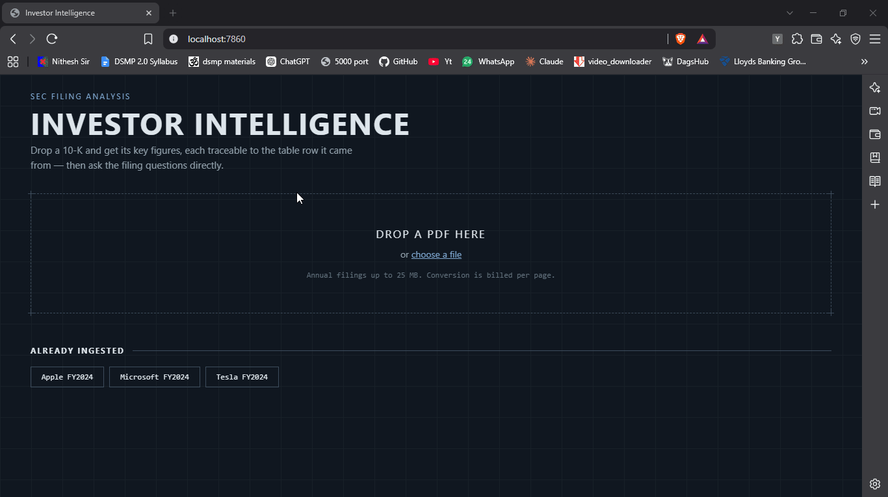
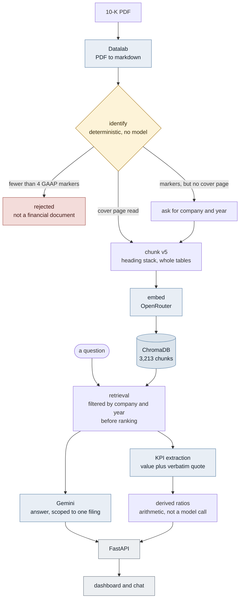
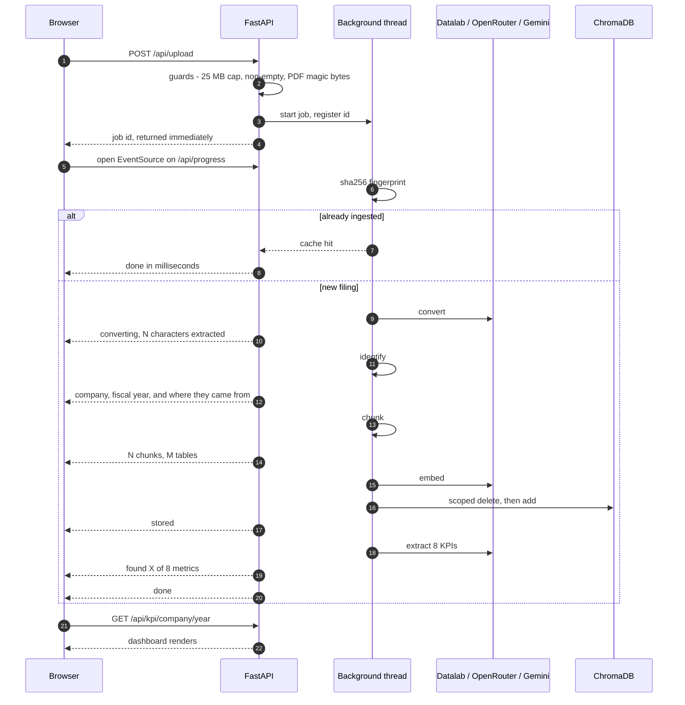

# Investor Intelligence

Ask questions of an SEC 10-K and get answers scoped to that filing. See its key
numbers on a dashboard, each one carrying the table row it was read from.

Three filings ship inside the image — Apple, Microsoft and Tesla, fiscal 2024 —
so it works the moment the container starts. Any other 10-K can be uploaded.

---

## The problem

The numbers an investor wants from a 10-K are in the document, but they are not
in one place. Revenue and operating income sit in the income statement, assets
and liabilities in the balance sheet, operating cash flow in a third statement,
the disclosed risks in Item 1A, and management's account of what drove growth in
the MD&A. A filing runs 100 to 150 pages. Pulling six figures and two lists out
of it by hand takes an hour, and doing it for three companies takes an afternoon.

Handing the PDF to a general-purpose model does not solve this. It will answer,
and the answer will be fluent, but there is no way to tell a figure it read from
a figure it produced — and a wrong number that looks right is worse than no
number at all. Financial data is only useful if it can be checked.

So the requirement was not "summarise a filing". It was:

- **every number traceable** — each value stored with the verbatim table row it
  came from, so it can be confirmed against the source in seconds
- **absence reported, not filled in** — if a filing has no Item 1A, say so rather
  than substituting something adjacent
- **scoped to one filing** — a question about Tesla is answered from Tesla's
  document, never from a neighbouring one that happens to embed nearby

Those three constraints drove most of the engineering below.

---

## Demo

<!-- Replace with the recorded walkthrough: upload -> streamed progress ->
     dashboard -> chat -> a deliberately out-of-scope question being refused. -->



---

## Run it

```bash
docker run -p 8000:8000 \
  -e GOOGLE_API_KEY=... \
  -e OPENROUTER_API_KEY=... \
  -e DATALAB_API_KEY=... \
  <dockerhub-user>/investor-intelligence
```

Then open <http://localhost:8000>.

No database, no volume, no migration step. The vector store and the KPI cache are
built into the image at build time, so a cold start is a process start.

`DATALAB_API_KEY` is only needed to upload a new filing; the three bundled ones
are already converted.

<details>
<summary>Running from source</summary>

```bash
python -m venv venv
venv\Scripts\pip install -r requirements.txt
copy .env.example .env        # then fill in the three keys
python -m app.pipeline        # builds the store from data/raw_pdfs/ (~25 min)
uvicorn app.main:app --reload
```
</details>

---

## What it does

- **Chat, scoped to one filing.** Retrieval is filtered by company and year
  before ranking, so context cannot leak between documents.
- **A KPI dashboard with provenance.** Six financial figures plus risk factors
  and growth drivers. Every figure carries its source quote.
- **Derived ratios.** Margins, ROE, ROA and cash conversion, computed from the
  extracted values rather than asked for separately — arithmetic is cheaper and
  more reliable than another model call.
- **Upload.** Drop in a 10-K and watch it convert, identify, chunk, embed and
  extract, with progress streamed over SSE.

---

## How it works



**The branch in the middle is the point.** `identify` is deterministic — no
model, no threshold. It reads the cover page for the registrant name and fiscal
year, and counts GAAP line-item markers to decide whether the document is a
financial filing at all. It has three outcomes, not two: accepted, rejected as
non-financial, or *financial but unidentifiable*, which asks for the company and
year instead of throwing the document away.

That middle branch exists because of a real filing. Microsoft's document is an
annual report with no 10-K cover page — a two-outcome gate would have discarded
it.

Note also that nothing expensive happens before the gate. Conversion is the only
cost that cannot be avoided, because you need the text to know what you have.
Everything downstream — ~1,200 embeddings and 8 extraction calls per filing —
sits behind it.

### What happens when you upload

The slow path had to report real progress rather than animate a fake bar, so the
job runs on a background thread and the browser follows it over Server-Sent
Events. Every message below is something the pipeline actually knows.



The scoped delete before the add is what makes re-ingesting a filing safe: a
second upload of the same company and year replaces its chunks rather than
doubling them. That is also why an interrupted build could simply be re-run —
when the Tesla embedding step died mid-way on a dropped connection, the retry
produced exactly 3,213 chunks, not 3,213 plus orphans.

The full build, including the approaches that were tried and dropped, is in
[`journey.md`](./journey.md).

---

## Evaluation

Small and hand-checked, not a benchmark suite. Three filings, 24 extractions,
every numeric value verified against the source document.

| Check | Result |
|---|---|
| Numeric KPIs correct | **18 / 18** across Apple, Microsoft, Tesla (FY2024) |
| Values traceable to a table row | **18 / 18** — automated quote-contains-number check, 0 flags |
| Balance-sheet identity (assets − liabilities → plausible equity) | passes on all 3 |
| Absent section reported, not fabricated | **1 / 1** — Microsoft Item 1A |
| Chunker: content loss | 0 characters |
| Chunker: duplicated content | 0 chunks |
| Chunker: table rows altered | 0 of 3,213 chunks |

**The negative case matters most.** Microsoft's source document is an annual
report, not a 10-K, and has no Item 1A. The system returns `absent` for its risk
factors. An earlier version matched on the phrase *"Risk Factors"* — which
appears three times in that document, every one a cross-reference — reported the
section present, and let the model substitute market-risk categories in its
place. The check now matches on `Item 1A`, a structural identifier, rather than
on a phrase that occurs in prose.

**Two automated checks catch what eyeballing cannot.** `looks_wrong()` reformats
each extracted number and asserts it appears inside its own source quote, which
catches a value that was inferred rather than read. `check_balance_sheet()`
subtracts liabilities from assets and asserts the remainder is positive and below
total assets — cheap arithmetic that catches two individually believable figures
that are inconsistent with each other.

**Retrieval, measured before and after.** `operating_income` was returning the
wrong chunk. Rank of the correct chunk, single-metric query versus a query naming
several income-statement line items together:

| Filing | Before | After |
|---|---|---|
| Apple 2024 | 1 | 1 |
| Microsoft 2024 | 4 | 1 |
| Tesla 2024 | 10 | 2 |
| Tesla 2025 | 26 | 3 |

**Latency**, warm, averaged over repeats — the first measurement was discarded
because the first API call pays a TLS handshake and the first Chroma query loads
the HNSW index:

| Stage | Time |
|---|---|
| Embedding one query | 0.50 s |
| Chroma similarity search | 0.58 s |
| `retrieve_chunks` end to end | 1.11 s |

Application import time was cut from **231 s to 20.5 s** — see below.

---

## Engineering notes

Three decisions worth the space. Each links to the section that records how it
was reached.

### Choosing a PDF extractor by failure mode, not by score

Four converters were compared on the same document with one variable changed at a
time. The front-runner won every automated metric — fewest artefacts, cleanest
markdown — and then failed a manual audit, because the metrics were counting
artefacts rather than correctness. The incumbent had silently dropped an entire
year column out of a financial table, and had been doing so unnoticed for weeks.

The decision was made on *which failures can be engineered around*: a converter
that leaves noise can be cleaned up, a converter that drops a column cannot,
because nothing downstream knows the column is missing.
— [journey §14](./journey.md#14-changing-the-extractor)

### A bug that produced plausible output for weeks

A `consumed` set existed to stop table captions being stored twice. It had never
prevented anything since the version it was introduced in — every caption was in
the store twice, and the output looked correct throughout, because duplicated
content is still correct content.

It surfaced only after adding a check for *duplication* alongside the existing
check for *loss*. A validation that tests only for what went missing is half a
validation.
— [journey §9](./journey.md#9-storage-correctness)

### Deterministic checks in place of a tuned threshold

A confidence cutoff of `DISTANCE_THRESHOLD = 1.30` was proposed for deciding
whether a section was really present. It was measured, and then rejected: the
value was fitted to one observation on one filing and had no reason to hold on
the next.

What replaced it holds by definition rather than by calibration — a structural
section marker, the accounting identity, and quote-contains-number. None of the
three has a number that needs re-tuning when a new filing arrives.
— [journey §17](./journey.md#17-kpi-extraction)

### One more, on cost

Application startup took 231 seconds. 58 s of that was `langchain_openai`
pulling in torch and transformers to serve a code path that was commented out,
and 101 s was the read path importing the chunker through a chain of module-level
imports it never used. Deleting the dead import and splitting the Chroma client
into its own module took startup to 20.5 s — an 11× reduction with no change to
behaviour.
— [journey §18](./journey.md#18-the-application-layer)

---

## CI

Two workflows, split on cost.

**[`ci.yml`](.github/workflows/ci.yml) — every push.** Free, holds no
credentials, makes no API calls. It lints for real errors only (syntax,
undefined names — not style, because a build that fails on line length trains
people to ignore CI), byte-compiles, imports the whole application, then runs a
regression suite against the KPI files committed in this repo.

That suite asserts the headline figures, that all 18 numeric values appear
verbatim in their own source quotes, that the balance sheet identity holds, that
the derived ratios compute, and that Microsoft's Item 1A is reported absent
rather than fabricated.

It also builds the image's `base` stage and runs the application inside it,
which catches the failure that matters most here: something that works on a
developer machine but not on the interpreter and pinned versions that ship.

**[`docker-publish.yml`](.github/workflows/docker-publish.yml) — manual only.**
Builds the full image and pushes it to Docker Hub.

This one is deliberately not on push. The full build converts three PDFs through
a third-party API, embeds ~3,200 chunks and makes 24 extraction calls: about
**25 minutes and real API credit every run**, against free-tier quotas. The
image contents only change when the filings or the pipeline change, so building
it on every commit would exhaust a day's quota by lunchtime and produce an
identical image each time. It is a `workflow_dispatch` button instead.

That split is the whole reason the `Dockerfile` has two stages. `--target base`
stops before the pipeline, so CI gets a genuine build validation — pins resolve,
context is complete, the app runs — without holding a single key.

---

## Known limits

- **No public URL.** See below.
- **Microsoft's document is an annual report, not a 10-K.** Its Item 1A panel is
  correctly empty; this is the system working, but it does look like a gap.
- **The `operating_income` query is tuned on a narrow family of filings.** It was
  fitted on Tesla and verified on Apple and Microsoft. It has not yet met a
  filing outside that family, and may need revisiting when it does.
- **No test suite.** The chunker invariants are enforced by a dry run rather than
  by `pytest` cases.
- **Three filings is a small evaluation set.** The numbers above are hand-checked
  and honest, but they are not a benchmark.

---

## Stack

| | |
|---|---|
| API + serving | FastAPI, uvicorn |
| PDF → markdown | Datalab (Marker) |
| Chunking | custom, hierarchical headings + section-scoped caption pairing |
| Embeddings | OpenRouter |
| Vector store | ChromaDB, persistent, scoped idempotent writes |
| Generation | Gemini |
| Frontend | plain HTML/CSS/JS, no framework |
| Packaging | Docker, multi-stage secrets, non-root |

Nine runtime dependencies, derived from what the code actually imports rather
than from install history. `requirements.txt` records what was removed and why,
so it does not creep back.

---

## Deployment

There is no hosted demo. The container idles at **455 MB** resident; free tiers
that do not require a credit card cap at 512 MB, and every tier that fits
comfortably — Cloud Run, Fly, Oracle Cloud — requires a card on file.

This is a constraint, not an unfinished step. The image runs unchanged anywhere
with 1 GB and a `PORT` variable. Until there is somewhere to put it, the
deliverable is the published image plus the recorded walkthrough above.

```
Image size    989 MB
Idle memory   455 MB
Cold start    process start only — the store is baked in
```

---

## Repo layout

```
app/         FastAPI application, background jobs, ingestion pipeline, derived metrics
ingestion/   PDF → markdown, deterministic identification, chunking v5
vector_store/ Chroma client and write path
Rag/         retrieval, chat, KPI extraction
config/      settings and model handles
static/      dashboard and upload UI
data/raw_pdfs/  the three reference filings
journey.md   the full build record, including what was tried and dropped
```
